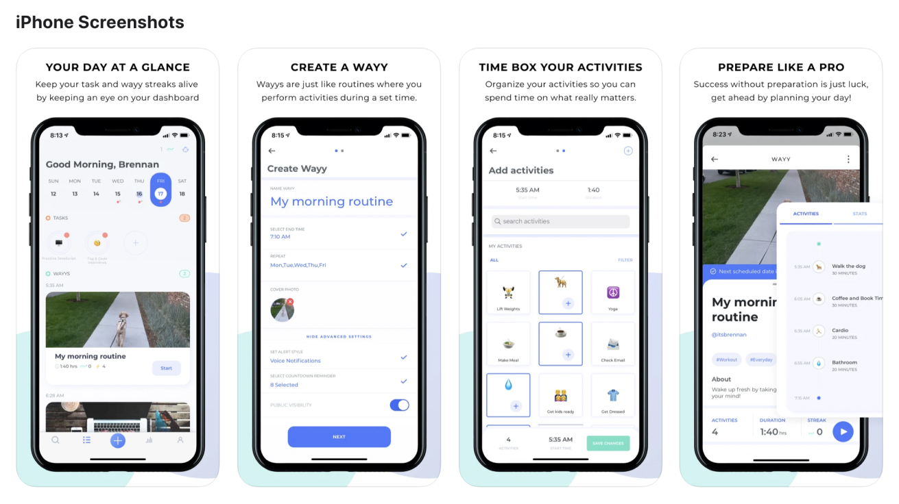

_(Brennan successfully launched MyWayy in 2020)_

[App Store Download](https://apps.apple.com/us/app/mywayy/id1326320955)

> You create your habits or they create you...

Have you ever felt stuck when trying to build new habits? Well you’re not alone. Building new habits can be an isolating experience especially when you’ve always done something one way. That’s why we created MyWayy, the ultimate habit building mobile application that turns habit creation into a team sport rather than a solo adventure where we utilize science to help you rewire your brain!

## The 4 Main Scientific Behavioral Change Techniques Behind Building New Habits
It can take some innovation to develop new habits that improve overall health, time management, and productivity. Thankfully, there are some proven techniques out there to help you build new habits and stick with them.
By applying the following four behavioral change techniques to your life, you can effectively get rid of bad habits and establish healthy daily routines that give you the best possible results. Whether you want to develop a healthy workout routine or another habit to help you get the most from your daily schedule, taking these courses of action will help you improve your habits in the long-term.

### 1. Needs and Goal Setting
Goal setting has been a big part of health education programs for a long time, but many people don't practice it the way they should. And setting a goal doesn't always motivate individuals to achieve that goal. For instance, if you're not someone who likes to exercise, setting a specific exercise goal may not benefit you or encourage you to begin exercising.
The key is determining what you need and making sure your goals don't conflict with others. If your goal is to improve your health with a workout routine, don't simply set a general goal such as "lose weight." Instead, set a specific goal such as "lose X amount of weight by July." Setting goals can improve performance using three motivational mechanisms: effort, concentration, and persistence. Put simply, setting specific and realistic goals can help motivate a person to invest more effort for a longer period of time with minimal distraction.

### 2. Action Planning and Execution
In order for goals to be successfully achieved and drive performance, the way the goal content is framed and people regulate the activities around these goals is crucial. One of the best ways to achieve your goals and execute them is to put an actionable plan in place.
You can incorporate a truly effective plan and execute it accordingly by practicing Brief Action Planning (BAP), which is a self-management method that can help you achieve your goals.
When using BAP to develop a good plan, start by considering whether a plan is effective by determining the "what," "where," "when," "why," and "how" behind it. For example, if you can take the time to exercise around 15 minutes per day and measure the results consistently, this plan may be ideal for meeting your ultimate goal of losing a certain amount of weight within a number of weeks. You can then determine the level of confidence you have in being able to carry out this plan, and if there are any doubts, you may want to make any necessary adjustments.
Once you've begun to execute the plan, make sure you review it at specific times periodically to gauge its effectiveness and make any further changes if necessary.

  

### 3. Feedback and Reward Systems
What makes goal setting and action planning so worthwhile to us is the brain reward system (BRS), which encourages us to keep going. The BRS is a reward system consisting of certain neural structures that are responsible for our desire for reward, associative learning, and all of those good feelings we enjoy when doing what we love.
To help encourage better habits and activate the BRS, it's important to be careful in developing the content and framing of recommendations along with feedback. Positively framed messages such as "walking every day will make me healthier" will be more beneficial and encouraging than negatively framed messages like "if I don't walk, my health will deteriorate." Positive reinforcement will help encourage improved habits by focusing on the rewards, and, in turn, achieving your goals will feel more rewarding. The more you're rewarded for completing various tasks and working toward your goals, the more your behavior is likely to change for the better.

### 4. Social Support and Accountability
It's not enough to have behavioral changes that focus solely on the individual who wants to change. It's also necessary to have sufficient social support and accountability, or even competition, that helps the individual make more progress. Social support may involve a family member or friend who supports the person's desire to develop new habits, or is there to work with them. The fact is that people who are supported are more likely to be active than those who don't receive any support.
People holding the individual accountable for failing to achieve goals or falling behind can also encourage the individual with that outside voice, which helps pull them back in to continue progressing.

  

## Conclusion
Incorporating these scientific behavioral change techniques when building new habits can mean the difference between success and failure. If you would like to get started building new habits today, [download MyWayy today](https://apps.apple.com/us/app/mywayy/id1326320955)!

  

---
